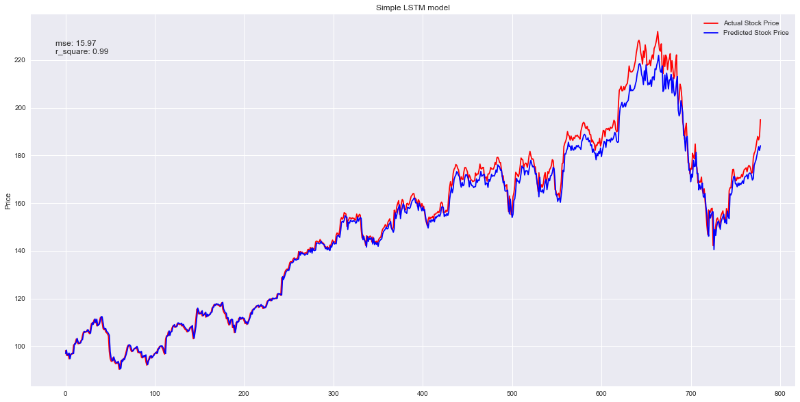
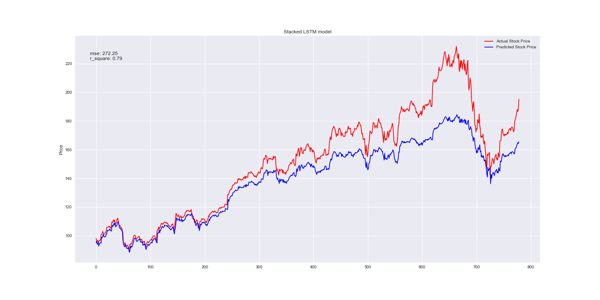

# recurrent-neural-network
Build recurrent-neural-network (particularly LSTM) to predict Apple Inc. stock price by exploring different structures and different date of test datasets.

  
 
    <h4>Apple Inc. historical price</h4>
  

  

  
 
    <h4>Simple LSTM model</h4>
  

  

  

  
 
    <h4>Stacked LSTM model</h4>
  

  

