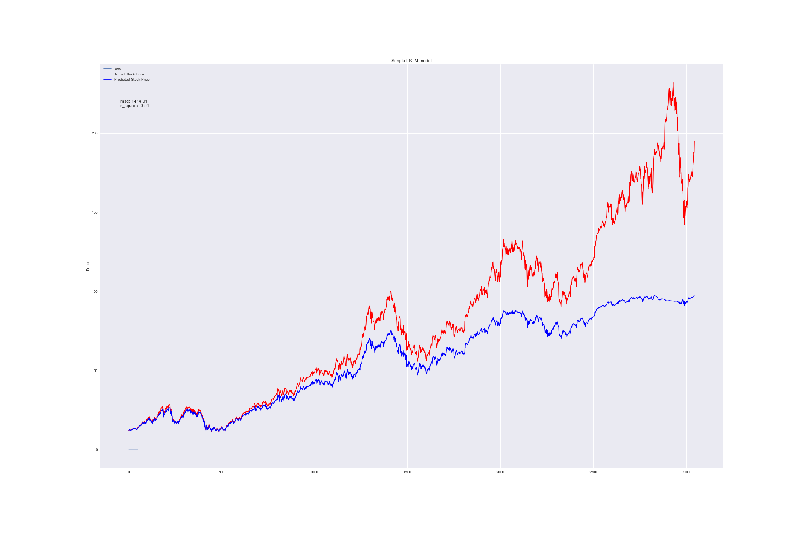
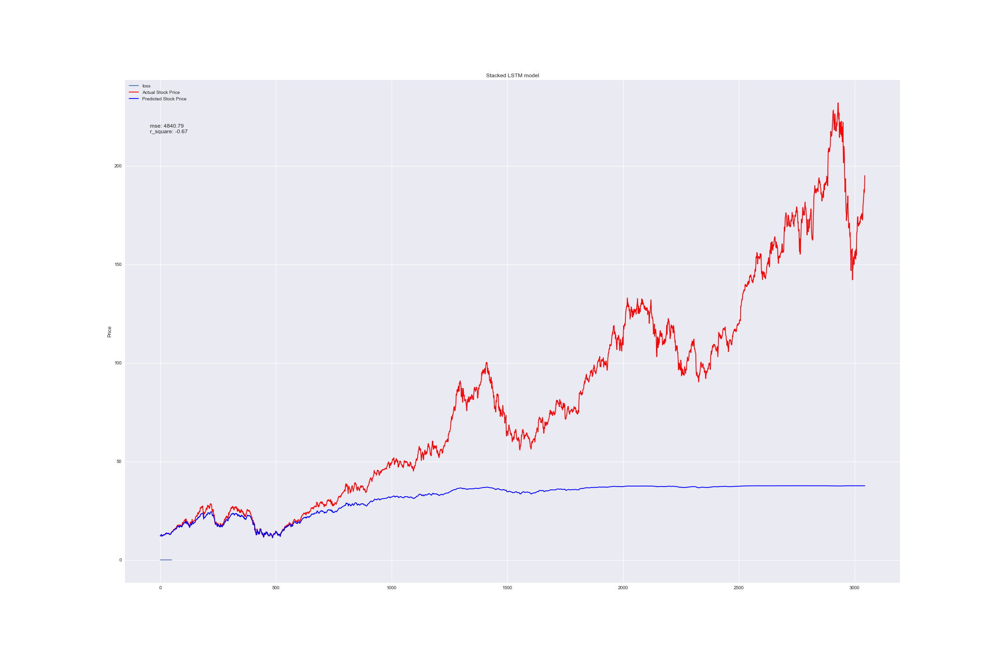
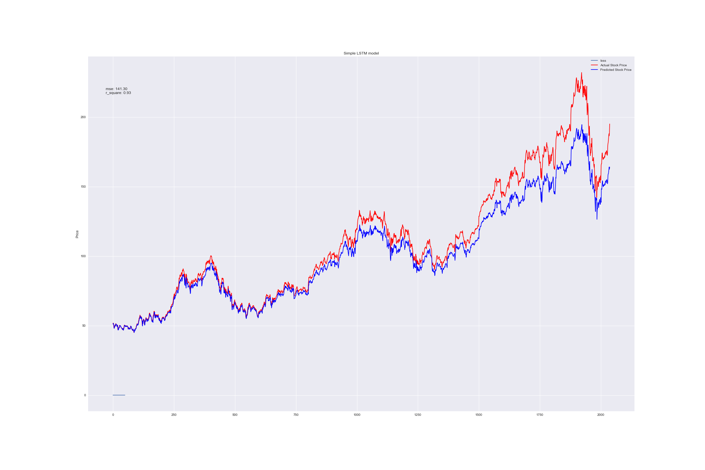
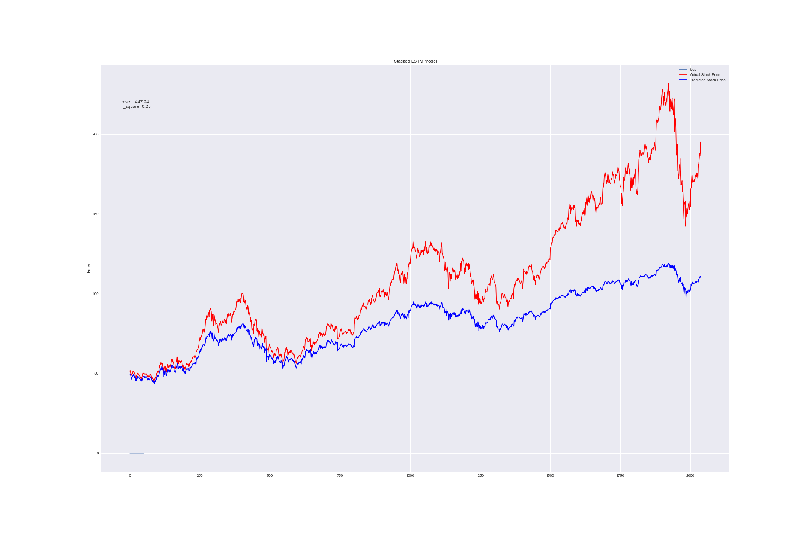
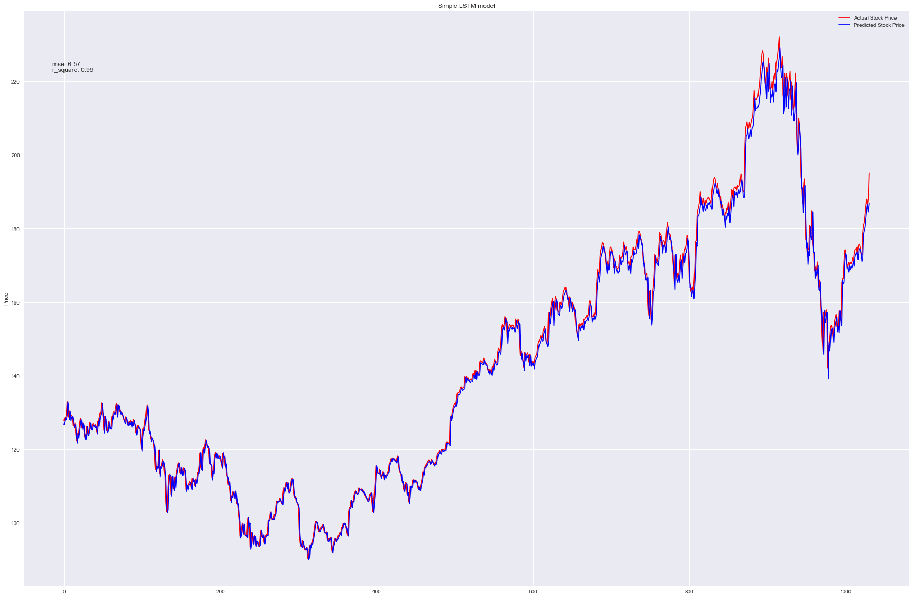
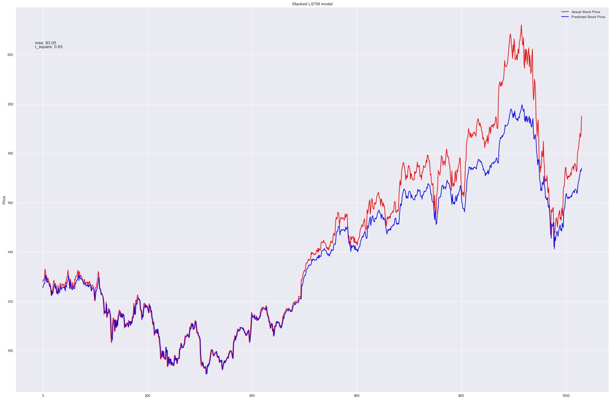

# recurrent-neural-network
The purpose of this assignment is to build LSTM model to predict stock prices.

<b>Datasets EDA</b>

The dataset consists of Apple Inc. daily historical stock prices from 1980-12-12 to 2019-03-21, a total of 9650 days. From the trend, we can see the stock price started to accelerate since approximate 2007, which was due to the first generation of iphone.
 
<b>Data Preprocessing</b>

The data is checked for Null value which could raise problem for time series. One Null entry at 1981-08-10 was found and replaced by previous day’s price. LSTM model(s) will be built for predicting the stock prices as time sequence. A time sequence of 30 days consecutive daily prices has been created as one instance.

<b>Training and Testing Data Split</b>

Since the stock price data has different trend patterns along the years, we want to try different dates to split the training and testing data, in order to test the consisteny of LSTM model, specifically how the model will be affected by trend. 
Three split year are chosen, including year 2007, 2011, and 2015.

<b>Model Structure</b>

For different year splits, both a single layer LSTM model and a stacked LSTM model are built to compare the performance. Please refer to the model results as below for details.

<b>Model Results</b>

<i>Split year – 2007</i>

Firstly, the data is splitted in the way that data before 2007 are used for training and after for testing, which ends up with 6545 training data and 3045 testing data, the test size is approximately 30%.
 

<i>Split year – 2011</i>

Secondly, the data is splitted in the way that data before 2011 are used for training and after for testing, which ends up with 7553 training data and 2037 testing data, the test size is approximately 20%.
 

<i>Split year – 2015</i>

Lastly, the data is splitted in the way that data before 2015 are used for training and after for testing, which ends up with 8589 training data and 1061 testing data, the test size is approximately 10%.
 

<b>Conclusion</b>

The table below shows the performance of two models on different year split in terms of R-square and MSE.
<table style="width:100%">
  <tr>
    <th>Year</th>
    <th>2007</th> 
    <th>2011</th>
    <th>2015</th>
    <th>2007</th> 
    <th>2011</th>
    <th>2015</th>
  </tr>
  <tr>
    <th>SINGEL</th>
    <th>0.51</th> 
    <th>0.93</th>
    <th>0.99</th>
    <th>1,414.01</th> 
    <th>141.30</th>
    <th>6.57</th>
  </tr>
  <tr>
    <th>STACKED</th>
    <th>-0.67</th> 
    <th>0.25</th>
    <th>0.93</th>
    <th>4,840.79</th> 
    <th>1,447.24</th>
    <th>83.05</th>
  </tr>
</table>

Two main conclusions can be derived from the above model results. One is the comparison between single model and stacked model. Although stacked model is considered to be a powerful to in NLP, single model seems to be better than stacked model in predicting stock price. The reason could be stacked models learn unnecessary patterns and are overfitting to training data. 

The other conclusion is that LSTM models (both single and stacked) perform better in predicting short-term stock price. Even for the worst performed stacked-model-2007, the prediction of the stock price in the first 500 days is considerably accurate. When the testing data get longer, the models failed to capture most of the long-term trend, because the models have never seen these new trends in training data.
